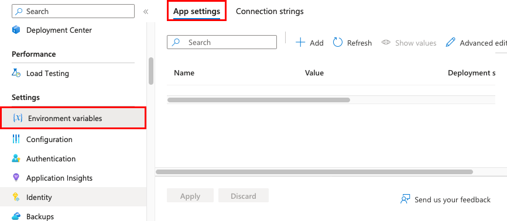
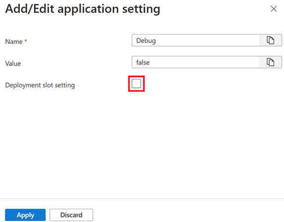
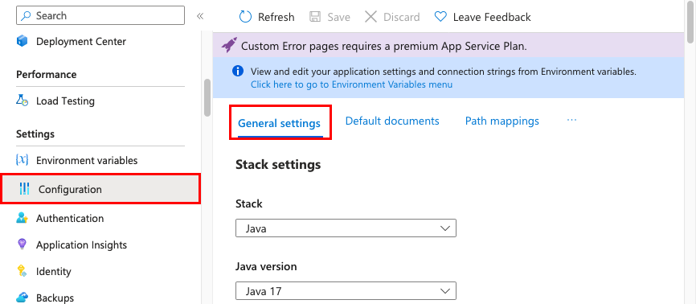
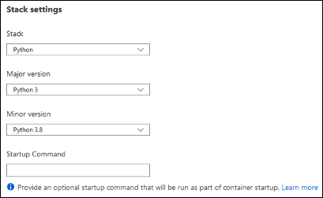

# Module 1: Azure App Services

<details>
  <summary><strong>Index</strong></summary>

  <details>
    <summary><a href="#introduction">Introduction</a></summary>

  - [Feature](#feature)
  - [Limitations](#limitations)

  </details>

  <details>
    <summary><a href="#azure-service-plans">Azure Service Plans</a></summary>

  - [Components of Azure Service Plans](#components-of-azure-service-plans)
  - [App run & Scale-out](#app-run--scale-out)

  </details>

  <details>
    <summary><a href="#deployment-to-app-service">Deployment to App service</a></summary>

  - [Automated Deployment](#automated-deployment)
  - [Manual Deploymemnt](#manual-deploymemnt)
  - [Deployment slots](#deployment-slots)
  - [Sidecar conatiners](#sidecar-conatiners)

  </details>

  <details>
    <summary><a href="#authentication--authorization-in-app-service">Authentication & Authorization in App Service</a></summary>
  </details>


  <details>
    <summary><a href="#app-service-networking">App service Networking</a></summary>

  - [Inbound Features](#inbound-features)
  - [Outbound Features](#outbound-features)
  - [Find outbound IPs](#find-outbound-ips)

  </details>

</details>

## Introduction
- A PaaS service to simplify __deployment and scaling__ of:
  1. Web Apps
  2. Mobile Backends
  3. Rest APIs
- __Language Support:__  .NET, Java (Java SE, Tomcat, JBoss), Node.js, Python, or PHP
- __OS Support:__ Windows & Linux

> 💡 To get supported languages and their version in linux:
>
>```bash
> az webapp list-runtimes --os-type linux
> ```

### Feature

1. __Auto scale support:__ Scale up/down or out/in based on usage
2. __Container support:__ Support images from private Azure Container Registry or Docker Hub
3. __CI/CD support:__  Support Azure DevOps Services, GitHub, Bitbucket, FTP, or a local Git repository on your development machine
4. __Deployment slots:__ Multiple swappable slots(QA, Dev, Stage) available other than Prod

### Limitations

1. Linux App service is not supported on Shared pricing tier.
2. Portal shows only features supported in linux app.
    > Initially App service was launched in windows, as they ported to linux they incrementally added feature in UI to prevent configuration errors. 
3. When we just upload the code to App service, it will be stores in Azure storage and then a built-in container will run that causing latency issue while accessing from Azure storage, instead we can create custom image and upload in container filesystem to reduce latency.

---

## Azure Service Plans

- Defines set of computing resources required to run web app.
- Multiple web app can run on same set of computing resources, i.e. in same Azure service plan.

### Components of Azure Service Plans

Each plan defines:
1. __Operating system:__ windows or linux
2. __Region:__ West US or East US etc
3. __Number of VM Instances__
4. __Size of VM Instances:__ P1V3, P2V3, based on pricing tiers
5. __Pricing tier:__ 
   1. Free
   2. Shared
   3. Basic
   4. Standard
   5. Premium
   6. PremiumV2
   7. PremiumV3
   8. IsolatedV2

__Free__ & __Shared__ runs app on same Azure VM as other App Services including app of other customers. Also resources does not scale out. _[Use for development & testing purpose only]_

__Isolated__ & __IsolatedV2__ runs on dedicated VM instance like other but also provide dedicated Azure virtual network. It gives maximum scale-out capabilities.

### App run & Scale-out

- An App will run on all configured VM instances, is 5 apps running in same Azure plan service then all those 5 app will run on all VM Instance
- Multiple deployment slot configured for an app will also run on all instances
- If diagnostic logs, perform backups, or run WebJobs enabled then they will also share allocated VM instaces 
- Pricing tiers can be changed any time.
- Apps can be moved from one Azure service plan to another.

---

## Deployment to App service

### Automated Deployment

This process is used to push out new features and fixes in fast and repetative pattern.
1. __Azure Devops Service:__ Push code in devops and build in cloud
2. __Github:__ Support automated deployment on any change in production branch.
3. __Bitbucket:__ Less used but supported

### Manual Deploymemnt

1. __Git:__ App service provide a git url which can be used as remote repository. Pushing to remote repo will deploy the app.
2. __CLI:__ Below feature of Azure CLI can be used to build and deploy app as well as create new App service web app.
    ```bash
    az webapp up
    ```
3. __Zip deploy;__ CURL or HTTP utility can be used to send zip file of app to App service.
4. __FTP/S:__ traditional way of pushing code to many environment including App service.
   
> 💡 `Kudu` is used for git and zip based deployments. It handled file syncing and  deployment triggers.

### Deployment slots

Deployment slots should be used to deploy to stage and swap to minimize downtime.

1. __Deploy Code:__ if slots have dedicated branches like qa, stage, test then those branches should be continously deployed.
2. __Deploy Container:__ In case of custom container, automating deployment of image from Azure container registry or other is complex and include below steps:
   1. Build an image and tag with git commit Id, timestamp, or other identifiable info.
   2. Push image in container registry.
   3. Update the deployment slot in App service with new image tag and it will pull from container registry.
  
### Sidecar conatiners

Sidecare container contains extra independent service like monitoring, logging, networking services

Upto __9__ sidecar container can be added to __Sidecar-enabled custom containers__.

---

## Authentication & Authorization in App Service

Optional built-in authenticaiton & authorization feature for Web apps, Mobile backend, Rest APIs and Azure functions.

Provide other integration like Microsoft Entra ID, Facebook, Google, X

When Enabled:
  - Use App service allocated VM for processing
  - Authenticate user with specified identity provider before reaching to app
  - Validate, store and refresh OAuth tokens provided by identity provider
  - Manages the authenticated sessions
  - Injects identity information to HTTP request

It can be configured using ARMs or config file

[Know more about identity provider and their endpoints](https://learn.microsoft.com/en-in/training/modules/introduction-to-azure-app-service/5-authentication-authorization-app-service)

---

## App service Networking

Azure App service provide features based on Inbound (request coming to app) & Outbound (request from app)

### Inbound Features

Controls how other service access the app in App service

1. __App Service Environment:__ Provide dedicated netwok isolated from public internet. It's most secure and most expensive.
2. __IP Restrictions:__ List of allowed IPs and block all other.
3. __Service endpoints:__ 
4. __Private endpoints:__ Provides private IP address in own virtual network, it can be accessed from that private network only with assigned IP.
  
### Outbound Features

Controls how app access to other services

1. __VNet integration:__ allows app to reach reosources within its own Azure Virtual Network. Only available for Standard, Premium and Isolated tiers.
   > __Requirements:__ Dedicated subnet with atleast 32 addresses (/27 CIDR block) available. For scaling /26 is recommended.
2. __Hybrid connections:__ Provide secure tunnel to reach resources outside Azure like on-prem database.

### Find outbound IPs

1. __Using portal:__ Click on `properties` on left-hand navigation of app.
2. __using CLI:__
    ```bash
    # Current outbound IPs used by app
    az webapp show \
      --resource-group <group_name> \
      --name <app_name> \ 
      --query outboundIpAddresses \
      --output tsv

    # Possible oubound IPs can be used by app regardless of pricing tiers
    az webapp show \
      --resource-group <group_name> \ 
      --name <app_name> \ 
      --query possibleOutboundIpAddresses \
      --output tsv
    ```

---

## Configure Web App

### Configure App Settings

It contains `environment variables` for the app in App Service.
It is injected when app starts and everytime environment variable changes app restarts

__Connection String__ are different than App settings. They contains database credentials.It is loaded with special prefixes (e.g., SQLCONNSTR_)



__Deployement slot setting:__  
`Non-Sticky settings` _(default)_ are those which are swapped during slot swapping. If stage is swapped to production then its variables also moves.  
`Sticky settings` these are configured for specific slots only. Swapping slots does not move sticky settings.



__Accessing Setting in code:__  
- C# / .NET: `Configuration["MySetting"]`
- Python: `os.environ.get('MySetting')`
- Node.js: `process.env.MySetting`
- Java: `System.getenv("MySetting")`

>💡 There are two ways to store App Settings
> 1. __Direct entry__ to the App Service configuration.
> 2. __Azure Key Vault__ _(Recommended)_ store variables in key vault and use pointer in App Service Settings. `@Microsoft.KeyVault(SecretUri=...)`

__Adding keys:__  
1. __Azure Portal:__ For small changes like adding/modifying one or two keys.
2. __JSON Array:__ Use `Advanced Edit` button and upload JSON in below format.
      ```JSON
    [
        {
          "name": "<key-1>",
          "value": "<value-1>",
          "slotSetting": false
        },
        {
          "name": "<key-2>",
          "value": "<value-2>",
          "slotSetting": false
        },
    ...
    ]
    ```
3. __Azure CLI:__ Use below command to update keys through Azure CLI.
      ```bash 
      az webapp config appsettings set \
        --name <app-name> \
        --resource-group <resource-group-name> \
        --settings MySetting=123
    ```

### Configure General Settings

- Controls platform & runtime options; **some settings require higher pricing tiers (Standard/Premium)**.
 
  

- __Stack settings:__ language/runtime and (Linux/custom containers) optional *start-up command/file*.

  

- __Platform settings:__
  - **Platform bitness:** 32-bit or 64-bit _(Windows only)_.
  - **FTP state:** disable or allow only FTPS _(recommended)_.
  - **HTTP version:** set to **2.0** to enable HTTP/2 (note: HTTP/2 typically used over TLS).
  - **WebSockets:** enable for SignalR or socket.io.
  - **Always On:** keeps the app loaded and prevents cold starts; **required** for continuous or CRON WebJobs.
  - **ARR affinity:** sticky sessions for stateful apps; set **Off** for stateless applications.
  - **HTTPS Only:** redirect all HTTP traffic to HTTPS.
  - **Minimum TLS version:** enforce TLS baseline for client connections.

- __Debugging:__ remote debugging available for ASP.NET / ASP.NET Core / Node.js (auto-disabled after 48 hours).

- __Incoming client certificates:__ enable for TLS mutual (client) authentication when required.

__CLI examples:__  
```bash
az webapp config set \
  --resource-group <resource-group> \
  --name <app-name> \
  --always-on true
```

```bash
az webapp update \
  --resource-group <resource-group> \
  --name <app-name> \
  --set httpsOnly=true
```

> 💡 **Tip:** Enable **HTTPS Only** + set a secure **Minimum TLS version** for production; prefer **FTPS** or disable FTP to reduce attack surface.

**Exam tips:**  
- Know that **Always On** is required for continuous WebJobs.  
- HTTP/2 benefits require TLS — secure custom domain to get HTTP/2 in browsers.  
- Be familiar with Portal path (Configuration → General settings) and CLI equivalents (`az webapp config set`, `az webapp update`).


### Configure Path Mappings


### Enable Diagnostic logging

### Configure Security settings

---