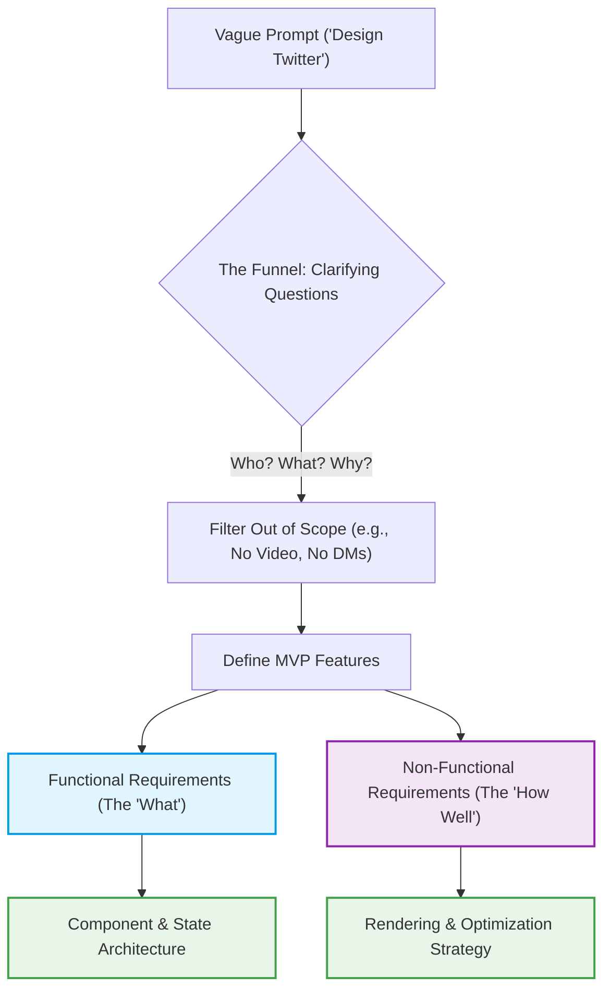
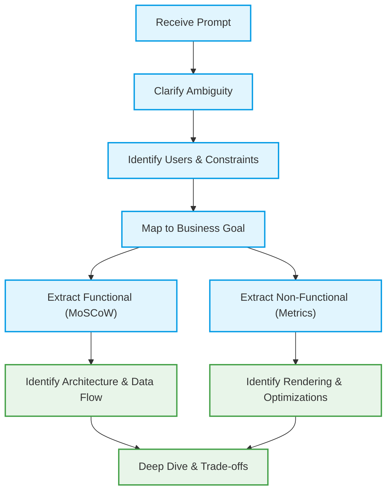
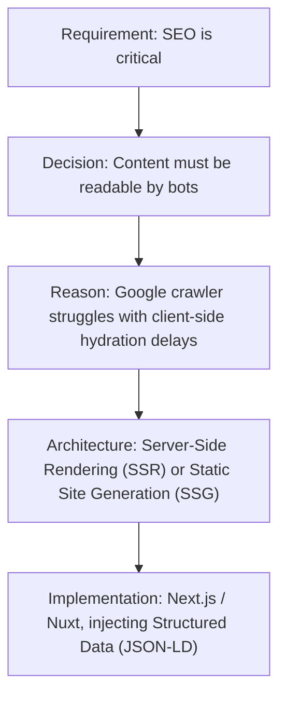
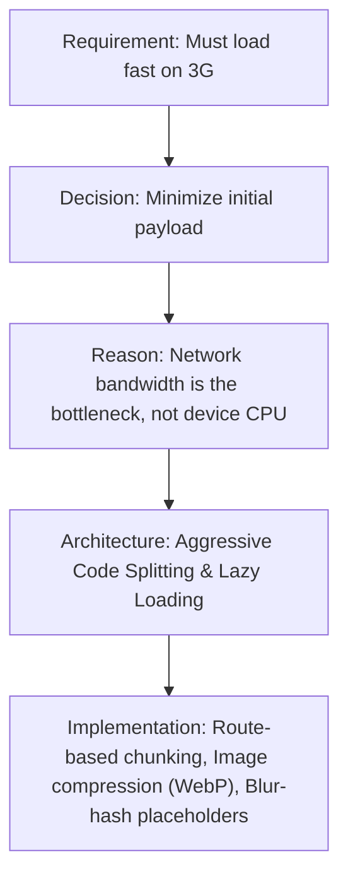
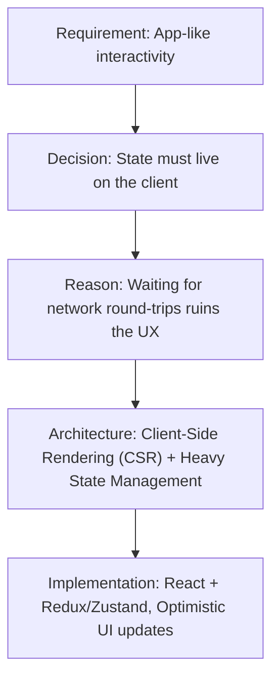
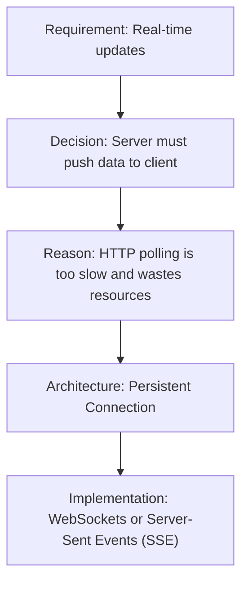
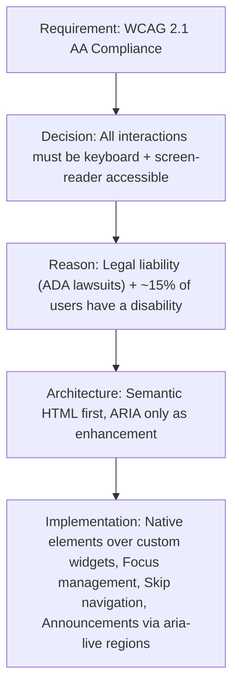

# Requirement Analysis — Complete Engineering Guide

> 💡 **Core Idea:** Requirement analysis is how you avoid building a beautifully optimized bicycle when the client actually needed a truck. It's translating vague ideas into strict engineering boundaries — the single highest-leverage activity in system design.

---

## Table of Contents

- [1. The Problem: Why Requirements Matter](#1-the-problem-why-requirements-matter)
- [2. The Mental Model: The Clarifying Funnel](#2-the-mental-model-the-clarifying-funnel)
- [3. The Two Pillars: Functional vs Non-Functional Requirements](#3-the-two-pillars-functional-vs-non-functional-requirements)
- [4. Step-by-Step Process: How to Actually Do This](#4-step-by-step-process-how-to-actually-do-this)
- [5. Requirement → Architecture Mapping](#5-requirement--architecture-mapping)
  - [5.1 The Master Matrix](#51-the-master-matrix)
  - [5.2 Deep Mapping: Offline Support](#52-deep-mapping-offline-support)
  - [5.3 Deep Mapping: Real-Time Data](#53-deep-mapping-real-time-data)
  - [5.4 Deep Mapping: High-Scale DOM](#54-deep-mapping-high-scale-dom)
  - [5.5 Business Goals → Architecture](#55-business-goals--architecture)
- [6. Trade-Offs: You Can't Have It All](#6-trade-offs-you-cant-have-it-all)
  - [6.1 The Sound Mixer Mental Model](#61-the-sound-mixer-mental-model)
  - [6.2 The 7 Senior Frontend Trade-Offs](#62-the-7-senior-frontend-trade-offs)
  - [6.3 The Triangle of Constraints](#63-the-triangle-of-constraints)
- [7. Decision Trees: How Senior Engineers Think](#7-decision-trees-how-senior-engineers-think)
  - [7.1 The FAANG Candidate Mental Flow](#71-the-faang-candidate-mental-flow)
  - [7.2 Technical Decision Trees](#72-technical-decision-trees)
- [8. Prioritization & Handling Ambiguity](#8-prioritization--handling-ambiguity)
  - [8.1 MoSCoW Prioritization](#81-moscow-prioritization)
  - [8.2 Stakeholder Conflict Navigation](#82-stakeholder-conflict-navigation)
  - [8.3 Handling Ambiguity: The 4-Step Loop](#83-handling-ambiguity-the-4-step-loop)
- [9. Engineering Metrics — Stop Saying "Fast"](#9-engineering-metrics--stop-saying-fast)
- [10. Frameworks & Mental Shortcuts](#10-frameworks--mental-shortcuts)
  - [10.1 The RADIO Framework](#101-the-radio-framework)
  - [10.2 The "3 Ws" Approach](#102-the-3-ws-approach)
  - [10.3 Recommended Reading](#103-recommended-reading)
  - [10.4 Practice Exercise](#104-practice-exercise)
- [11. Anti-Patterns & Requirement Smells](#11-anti-patterns--requirement-smells)
- [12. Key Takeaways & Quick-Recall Cheat Sheet](#12-key-takeaways--quick-recall-cheat-sheet)

---

## 1. The Problem: Why Requirements Matter

> 💡 Every broken system can be traced back to a broken — or missing — requirement conversation.

Imagine an interviewer says, **"Design a News Feed."**
Your first instinct? Jump to the whiteboard. Start drawing React components. Add Redux for state.

**Here is why that fails:**

- What if the users are exclusively on slow 3G connections? Your giant React app just crashed their phones.
- What if the feed is for 100% video content like TikTok? Your text-based architecture is now completely useless.
- What if it must work offline for field workers? Your entire data flow just collapsed.

The root cause is always the same: **you solved the wrong problem efficiently.**

**The Better Way:** You pause. You ask questions. You establish the boundaries *before* you build the house. Requirements are not a "nice to have" phase — they are the phase that determines whether everything you build afterward is useful or wasted.

> **Why this matters in interviews:** Interviewers give vague prompts on purpose. They are not testing your React skills — they are testing whether you can think before you code. The first 5 minutes of scoping are worth more than 20 minutes of architecture.

---

## 2. The Mental Model: The Clarifying Funnel

> 💡 Every great system design starts wide and narrows down. The funnel is how you go from "Build me Twitter" to a buildable spec in under 5 minutes.

Think of this phase as a giant funnel:

1. **Top (Wide & Vague):** "Build me Twitter."
2. **Middle (Filtering):** "Are we doing video? No. Direct messages? No."
3. **Bottom (Narrow & Concrete):** "We are building a mobile-first, text-only feed for slow networks."

### The Vehicle Analogy

This is the simplest way to internalize why the funnel matters:

- **Vague Prompt:** "Build me a vehicle."
- **Naive Engineer:** Immediately builds a 1000-horsepower Formula 1 engine.
- **Senior Engineer:** Asks, "Where are we driving?" (Off-road). "How many passengers?" (Five).
- **Result:** The Senior Engineer builds a Jeep. The Junior built an F1 car that gets stuck in the mud.

The funnel is the difference between building the right thing and building the thing right. You need both — but the right thing comes first.

---

## 3. The Two Pillars: Functional vs Non-Functional Requirements

> 💡 Features dictate state. Constraints dictate architecture. Know which bucket a requirement falls into and you know what part of the system it affects.

Every single requirement falls into one of two buckets:

### Functional Requirements (The "What")

This is what the user can physically **do**.
- Can they click a "Like" button?
- Can they upload an image?
- Do they scroll infinitely, or click "Page 2"?

👉 *Functional requirements tell you what Components to build and what State to manage.*

### Non-Functional Requirements (The "How Well")

This is the invisible stuff — how the system behaves under pressure. This is what separates Junior from Senior engineers.
- **Speed:** Must load in under 2 seconds.
- **Scale:** Must handle scrolling through 10,000 items without lagging.
- **Audience Constraints:** Must work on low-end Android phones.
- **Accessibility (a11y):** Must be usable by screen readers.

👉 *Non-functional requirements dictate your Rendering Strategy (SSR vs CSR) and Performance Optimizations (Virtualization, Lazy Loading).*

### Comparison Table

| Dimension | Functional Requirements | Non-Functional Requirements |
| :--- | :--- | :--- |
| **Definition** | What the system **does** — user-visible features and behaviors | How **well** the system does it — quality attributes and constraints |
| **Examples** | Login, upload image, search, infinite scroll, like button | Load time < 2s, works offline, WCAG 2.1 AA compliance, handles 100k users |
| **What It Dictates** | Components, state management, data model, API contracts | Rendering strategy, caching, bundling, optimization patterns |
| **Visibility** | Directly visible to users — they can see and interact with it | Invisible to users — they feel it (speed, reliability) but can't point to it |
| **Interview Signal** | Shows you can scope features and define MVP boundaries | Shows you think about architecture quality, production readiness, and scale |
| **Failure Mode** | Missing FR = missing feature (user complains "I can't do X") | Missing NFR = system breaks under stress (app crashes, loads slowly, inaccessible) |

---

## 4. Step-by-Step Process: How to Actually Do This

> 💡 Run this exact mental script every time. It takes 3-5 minutes and saves hours of rework.

When you are handed a task, run this exact script in your head:

### Step 1: Pause & Acknowledge
*"Okay, a News Feed. Before I draw architecture, let's narrow the scope."*

- **Why this matters:** Jumping straight to architecture signals junior thinking. Pausing signals that you understand the cost of building the wrong thing.
- **What you're doing internally:** Resisting the urge to solve. Switching from "builder mode" to "detective mode."

### Step 2: Find the Core Flow
*"What is the #1 most important thing the user does here?"* (e.g., Read posts).

- **Why this matters:** Every product has ONE core loop. If you can't identify it, you'll spread your architecture too thin across secondary features.
- **How to find it:** Ask yourself, "If the user could only do ONE thing, what would it be?" That's your core flow.

### Step 3: List the Features (Functional)
*"Let's stick to text/images and liking. No comments for now."*

- **Why this matters:** This is where you draw the scope boundary. Everything inside the line gets built; everything outside gets explicitly deferred.
- **Technique:** Use MoSCoW (see [Section 8.1](#81-moscow-prioritization)) to bucket features into Must/Should/Could/Won't.

### Step 4: Find the Constraints (Non-Functional)
*"Are there any specific network or device constraints I should optimize for?"*

- **Why this matters:** Constraints are the hidden architecture shapers. The same feature (infinite scroll) needs a completely different architecture on 3G vs 5G.
- **Key questions:** Who are the users? What devices? What network conditions? What scale? Any regulatory requirements (GDPR, accessibility)?

### Step 5: Summarize and Lock It In
*"To summarize: We are building a mobile-only text feed optimized for slow networks. Does that sound right?"*

- **Why this matters:** This creates a verbal contract with the interviewer (or stakeholder). It prevents scope creep and gives you a reference point if they add features later.
- **The power move:** Summarizing forces alignment. If there's a misunderstanding, this is the cheapest place to catch it.

---

## 5. Requirement → Architecture Mapping

> 💡 Every single requirement eventually changes the architecture. The bridge between "What we need" and "How we build it" is called Architecture Mapping.

When you gather requirements, you are actually building a shopping list of architectural patterns. Here is how FAANG engineers map requirements to deep technical implementations.

### 5.1 The Master Matrix

Use this table to instantly categorize requirements and state their architectural impact.

| Requirement | Type | Architectural Impact |
| :--- | :--- | :--- |
| **Login / Authentication** | Functional | Auth guards, JWT storage (HttpOnly cookies), Route protection. |
| **Upload Image** | Functional | FormData APIs, Progress bars, S3 presigned URLs, Chunked uploads. |
| **Search / Autocomplete** | Functional | Debouncing, AbortControllers (canceling old requests), Caching. |
| **Works Offline** | Non-Functional | Service Workers, IndexedDB, Background Sync, Optimistic UI. |
| **SEO (Search Engine Opt.)** | Non-Functional | Server-Side Rendering (SSR), Dynamic Meta Tags, Structured Data. |
| **Fast First Paint** | Non-Functional | Code splitting, Critical CSS extraction, Edge CDNs. |
| **Screen Reader Support** | Non-Functional | Semantic HTML, ARIA attributes, Keyboard focus trapping. |
| **Global Audience (i18n)** | Non-Functional | RTL (Right-to-Left) CSS support, Intl Date/Currency formatting. |
| **100k Concurrent Users** | Non-Functional | CDN caching, Stateless architecture, Static Site Generation (SSG) where possible. |
| **3G / Slow Network Support** | Non-Functional | Image optimization (WebP/AVIF), Lazy loading, Skeleton loaders. |

> **How to use this table:** When you hear a requirement in an interview, mentally look it up here. The "Architectural Impact" column gives you the first 2-3 technologies to mention. This is the fastest way to sound senior.

### 5.2 Deep Mapping: Offline Support

If a requirement is "Must work on the subway/offline."

- **Requirement:** Need Offline Capabilities.
- **⬇️ Architecture:** Service Workers (to act as a network proxy).
- **⬇️ Storage:** IndexedDB (to store complex JSON/relational data locally, since LocalStorage is synchronous and blocks the main thread).
- **⬇️ Synchronization:** Background Sync API (to queue actions like "Like a post" and fire them when the network returns).

> **Why IndexedDB over LocalStorage?** LocalStorage is synchronous — it blocks the main thread during reads/writes. IndexedDB is async and can store structured data, binary blobs, and handle complex queries. For anything beyond simple key-value pairs, IndexedDB is the only viable option.

### 5.3 Deep Mapping: Real-Time Data

If a requirement is "Users must see new messages instantly."

- **Requirement:** Need Real-Time Data.
- **⬇️ Architecture:** WebSockets (for bi-directional communication).
- **⬇️ State Management:** Redux/Context with a middleware to handle socket events.
- **⬇️ Resilience:** Reconnect Strategy (Exponential backoff when the socket drops) and offline message queuing.

> **WebSockets vs SSE:** WebSockets are bi-directional (client ↔ server). Server-Sent Events (SSE) are unidirectional (server → client). If the client only needs to *receive* updates (stock ticker, live scores), SSE is simpler. If the client also *sends* data (chat, collaboration), WebSockets are necessary.

### 5.4 Deep Mapping: High-Scale DOM

If a requirement is "Users will scroll through a feed of 10,000 items."

- **Requirement:** High-Scale Data Rendering.
- **⬇️ Architecture:** DOM Virtualization / Windowing.
- **⬇️ Implementation:** Only render the 10 items currently visible on screen. Recycle DOM nodes as the user scrolls.
- **⬇️ Memory Management:** Garbage collection awareness, removing hidden heavy assets (like videos) from memory to prevent mobile browser crashes.

> **The core insight:** The DOM is not free. Every node consumes memory and participates in layout calculations. 10,000 DOM nodes means 10,000 objects the browser must track, style, and potentially re-layout on every scroll frame. Virtualization reduces this to ~20-30 nodes regardless of list size.

### 5.5 Business Goals → Architecture

Requirements do not exist in a vacuum. They exist to serve business goals. If you can trace your technical architecture all the way back to a business metric, you will pass the interview.

#### Example A: The E-Commerce Growth Goal
- **Business Goal:** Increase Conversion Rate / Sales.
- **⬇️ Product Requirement:** Page must load instantly (Amazon found 100ms of latency cost them 1% in sales).
- **⬇️ Architecture:** Edge Caching (CDN).
- **⬇️ Implementation:** Static Site Generation (SSG) for product pages, served globally from the Edge, with hydration only for the "Add to Cart" button.

#### Example B: The Social Media Engagement Goal
- **Business Goal:** Increase Time-in-App (Retention).
- **⬇️ Product Requirement:** Frictionless content consumption (Infinite Scroll).
- **⬇️ Architecture:** Cursor-based pagination with Intersection Observers.
- **⬇️ Implementation:** Prefetching the next page of data *before* the user reaches the bottom of the screen to guarantee zero loading spinners.

#### Example C: The SaaS Acquisition Goal
- **Business Goal:** Acquire more users organically.
- **⬇️ Product Requirement:** High search engine visibility (SEO).
- **⬇️ Architecture:** Server-Side Rendering (SSR).
- **⬇️ Implementation:** Dynamic meta-tags, OpenGraph tags for social sharing, and JSON-LD structured data injected into the head on the server.

---

## 6. Trade-Offs: You Can't Have It All

> 💡 You can't have it all. Every time you say "yes" to a requirement, you are secretly saying "no" to a performance metric, development speed, or architectural simplicity.

### 6.1 The Sound Mixer Mental Model

Imagine a sound mixing board. If you push the "Rich Animations" slider all the way up, the "Fast Loading Speed" slider usually gets forced down.

As a senior engineer, your job isn't to say "I will build everything perfectly." Your job is to say, **"If we want X, it will cost us Y. Are you okay with that?"**

This is the single most valuable skill in system design interviews. Identifying trade-offs unprompted signals senior-level thinking.

### 6.2 The 7 Senior Frontend Trade-Offs

Listen closely during requirement gathering. When you hear these keywords, immediately recognize the trap and discuss the trade-off.

#### 1. The Rendering Trap: SEO vs. Interactivity
- **The Conflict:** "We need incredible SEO, BUT it needs to feel like a snappy desktop app."
- **The Trade-off:** Server-Side Rendering (SSR) gives great SEO but delays interactivity (hydration cost). Client-Side Rendering (CSR) feels snappy but ruins initial SEO.

#### 2. The State Trap: Consistency vs. Availability (Optimistic UI)
- **The Conflict:** "When the user clicks 'Like', it must feel instant."
- **The Trade-off:** An Optimistic UI (instant update) risks lying to the user if the network fails. A Pessimistic UI (waiting for the server) guarantees truth but feels sluggish.

#### 3. The Performance Trap: Performance vs. Accessibility (A11y)
- **The Conflict:** "We want a fully custom, heavily animated dropdown menu."
- **The Trade-off:** Building custom UI widgets often breaks native browser accessibility (keyboard navigation, screen readers). Adding massive ARIA polyfills increases bundle size and hurts performance. Native `<select>` is fast and accessible, but ugly.

#### 4. The Data Trap: Memory vs. Speed
- **The Conflict:** "Users will scroll through a feed of 10,000 HD images."
- **The Trade-off:** Caching all those DOM nodes in memory makes scrolling back up blazing fast, but it will crash a mobile browser (Memory leak). Using DOM Virtualization saves memory, but costs CPU cycles to constantly mount/unmount components.

#### 5. The Business Trap: Bundle Size vs. Developer Experience (DX)
- **The Conflict:** "We need to launch this MVP next Friday."
- **The Trade-off:** To launch fast, you use heavy libraries (Material UI, Lodash, Moment.js). This creates a great DX and fast delivery, but bloats the bundle and destroys the user's initial load time.

#### 6. The Network Trap: Caching vs. Freshness
- **The Conflict:** "The dashboard needs to load instantly, but always show accurate data."
- **The Trade-off:** Caching API responses at the Edge (CDN) guarantees instant load times, but the user might see stale data. Bypassing the cache guarantees fresh data, but means the user waits for database queries every time.

#### 7. The Resilience Trap: Offline Capabilities vs. Data Accuracy
- **The Conflict:** "Users must be able to edit documents on an airplane."
- **The Trade-off:** Offline editing means storing data locally (IndexedDB). When the user reconnects, you now face massive merge conflicts if someone else edited the same document online. Offline support requires immensely complex sync engines (CRDTs).

### 6.3 The Triangle of Constraints

The ultimate frontend reality check. You can pick TWO, but rarely all THREE:

1. 🏎️ **Fast Initial Load**
2. 🎮 **Rich Client Interactivity**
3. 💸 **Low Development / Server Cost**

*(Want fast load and rich interactivity? You'll need complex SSR/hydration architectures which costs massive development time).*

#### Practical Constraint Combinations

| You Want | + You Also Want | You Sacrifice | Example Architecture |
| :--- | :--- | :--- | :--- |
| 🏎️ Fast Initial Load | 🎮 Rich Interactivity | 💸 Low Cost | SSR + Hydration (Next.js) — complex, expensive to build and maintain |
| 🏎️ Fast Initial Load | 💸 Low Cost | 🎮 Rich Interactivity | Static Site Generation (SSG) — fast and cheap, but limited dynamic behavior |
| 🎮 Rich Interactivity | 💸 Low Cost | 🏎️ Fast Initial Load | Client-Side SPA (CRA/Vite) — snappy once loaded, but slow initial paint |

> **Interview insight:** When an interviewer asks "Can we have all three?", the senior answer is: "Partially, using techniques like partial hydration, islands architecture, or streaming SSR — but each adds complexity. Let's pick our priority based on the business goal."

---

## 7. Decision Trees: How Senior Engineers Think

> 💡 Senior engineers do not jump from Requirement to Architecture. They jump from Requirement ➡️ Decision ➡️ Reason ➡️ Architecture. This chain of reasoning is what interviewers are actually evaluating.

### 7.1 The FAANG Candidate Mental Flow

Before looking at specific technical decision trees, memorize the master flow of how a senior engineer navigates an interview prompt:

### 7.2 Technical Decision Trees

Here is how you bridge the gap between a business requirement and a technical architecture using decision trees. Each tree follows the pattern: **Requirement → Decision → Reason → Architecture → Implementation.**

#### Tree 1: The SEO & Discovery Tree
If the business goal relies on users finding the content via Google.

#### Tree 2: The Slow Network / Emerging Market Tree
If the users are on 3G connections (e.g., global launch in India/Brazil).

#### Tree 3: The High-Interactivity / Dashboard Tree
If the app is an internal tool or complex dashboard (e.g., Figma, Jira).

#### Tree 4: The Real-Time Data Tree
If the data changes constantly and multiple users are viewing it (e.g., Trading app, Chat).

#### Tree 5: The Accessibility-Critical Tree
If the product must comply with WCAG standards (e.g., Government apps, Healthcare, Banking).

> **Key Takeaway:** When an interviewer gives you a requirement, do not just say "I will use SSR."
> Say: **"Because SEO is a requirement (Requirement), we must ensure bots can read the HTML instantly (Decision). Since client-side rendering delays this (Reason), we must architect this using Server-Side Rendering (Architecture)."**

---

## 8. Prioritization & Handling Ambiguity

> 💡 Requirement analysis is messy. Stakeholders fight, scopes creep, and prompts are intentionally vague. These tools help you cut through the noise.

### 8.1 MoSCoW Prioritization

In the real world (and in interviews), you cannot build everything. You must ruthlessly prioritize using the MoSCoW method.

- **M — Must Have:** Non-negotiable. Without this, the product fails. (e.g., E-commerce *must* have a Checkout).
- **S — Should Have:** Important, but not critical for launch. (e.g., Dark Mode).
- **C — Could Have:** Nice to have, if time permits. (e.g., Micro-animations on buttons).
- **W — Won't Have (for now):** Explicitly out of scope. (e.g., VR Shopping).

**Why this matters:** When an interviewer asks, "What if we also want users to upload 4K video?", you can say, *"That sounds like a 'Could Have' or 'Won't Have' for our MVP today. Let's focus on the 'Must Haves' first to ensure our core architecture is solid."*

> **The hidden power of "Won't Have":** Explicitly stating what you are NOT building is just as valuable as stating what you are building. It demonstrates scope discipline and prevents architecture overengineering.

### 8.2 Stakeholder Conflict Navigation

Real requirement analysis isn't just technical. It is political. Different stakeholders want opposing things. A senior engineer knows how to balance these conflicts.

| Stakeholder | Their Primary Goal | The Architectural Conflict |
| :--- | :--- | :--- |
| **Product Manager** | More Features, Faster Time-to-Market | Bloated bundles, technical debt, rushed UI. |
| **UX Designer** | Beautiful, Complex, Custom UI | Performance hits (heavy CSS/JS), Accessibility gaps. |
| **Marketing** | SEO, Tracking Pixels, Analytics | Heavy third-party scripts blocking the main thread, hurting Core Web Vitals. |
| **Legal** | GDPR, Data Privacy | Cookie consent blockers breaking tracking, localized data storage requirements. |
| **Engineering** | Performance, Clean Code, Scalability | Taking too long to ship, over-engineering simple features. |

**The Senior Move:** If an interviewer role-plays a PM asking for 10 tracking scripts, you respond: *"I understand Marketing needs analytics. However, adding 10 scripts will block the main thread and hurt our LCP score. Let's compromise by loading them asynchronously via a Tag Manager after the critical UI has rendered."*

### 8.3 Handling Ambiguity: The 4-Step Loop

Often, the interviewer will give you an impossibly vague prompt: *"Design YouTube."* They do this on purpose to see how you handle ambiguity.

Follow this strict loop:

1. **State the Assumption:** *"Since you said 'Design YouTube', I am going to assume we are focusing only on the Video Player page, not the Creator Studio."*
2. **Explain the Impact:** *"I am making this assumption because the Video Player requires deep knowledge of streaming protocols and performance, whereas the Studio is mostly a heavy CRUD dashboard."*
3. **Proceed:** *"Does that assumption work for you, or would you prefer I focus on the Studio?"*
4. **Adjust Later:** If they correct you, seamlessly pivot. *"Got it, we'll focus on the Studio. In that case, we need to shift our focus to complex state management and large form data handling."*

### 8.4 Non-Functional Requirement Prioritization

NFRs also need ordering — not just FRs. Not every quality attribute matters equally for every product. The business goal dictates which NFR wins when they conflict.

| Product Type | #1 NFR Priority | #2 NFR Priority | Deprioritized NFR | Reasoning |
| :--- | :--- | :--- | :--- | :--- |
| **E-Commerce** | Performance (LCP) | SEO | Offline Support | Revenue directly correlates with page speed |
| **Chat / Messaging** | Real-time Reliability | Offline Resilience | SEO | Users expect instant message delivery |
| **Government Portal** | Accessibility (WCAG) | Security | Rich Interactivity | Legal mandate + diverse user base |
| **Internal Dashboard** | Interactivity | Data Freshness | SEO | No public users, no crawlers |
| **Content Blog / News** | SEO | Performance | Rich Interactivity | Organic traffic is the growth engine |

> **The principle:** When two NFRs conflict (e.g., performance vs. accessibility), the business goal is the tiebreaker. Always trace back to "What makes this product succeed?"

---

## 9. Engineering Metrics — Stop Saying "Fast"

> 💡 In an interview, do not say "The app needs to be fast." Say: "We need to optimize our Core Web Vitals to hit these specific thresholds." Vague language signals junior thinking. Specific metrics signal engineering maturity.

| Metric | Threshold | What It Measures | Why It Matters |
| :--- | :--- | :--- | :--- |
| **TTFB** (Time to First Byte) | `< 200ms` | How fast the server responds to the first request | Bottleneck indicator — if TTFB is slow, everything downstream is delayed |
| **FCP** (First Contentful Paint) | `< 1.8s` | When the first pixel of text/image appears on screen | User's first signal that the page is loading (perceived performance) |
| **LCP** (Largest Contentful Paint) | `< 2.5s` | When the main hero image or largest text block finishes rendering | Google ranking factor; directly affects SEO and user trust |
| **FID** (First Input Delay) | `< 100ms` | How fast the app responds when the user first interacts | Being replaced by INP — measures responsiveness to the very first click/tap |
| **INP** (Interaction to Next Paint) | `< 200ms` | Visual feedback latency after any click/tap throughout the session | Successor to FID; measures ALL interactions, not just the first one |
| **CLS** (Cumulative Layout Shift) | `< 0.1` | How much the page layout jumps around while loading | Crucial for E-commerce — layout shifts cause mis-clicks and erode trust |
| **Bundle Size Budget** | `< 200kb` gzipped | Total JavaScript shipped for the initial route | Directly affects parse time, especially on low-end mobile devices |

> **Pro tip:** When discussing metrics in an interview, always connect the metric to a business outcome. "We need LCP under 2.5s because Google uses it as a ranking signal, and our business goal is organic acquisition through SEO."

---

## 10. Frameworks & Mental Shortcuts

> 💡 Having a structured framework prevents you from blanking out in an interview. These are battle-tested thinking tools.

### 10.1 The RADIO Framework

Developed by GreatFrontEnd, this is a standard flow for frontend system design. Requirement analysis is the "R".

- **R** — Requirements (Functional & Non-Functional)
- **A** — Architecture / High-Level Design
- **D** — Data Model
- **I** — Interface Definition (API)
- **O** — Optimizations and Deep Dives

> **How to use it:** RADIO gives you a predictable structure for any interview. Spend ~5 minutes on R, ~10 minutes on A+D+I, and ~15 minutes on O. The "R" phase shapes everything that follows — skip it and the rest falls apart.

### 10.2 The "3 Ws" Approach

A simpler mental model to use during the first 2 minutes of an interview:

- **Who** is this for? (Audience, Network, Devices)
- **What** is the core flow? (MVP Functional Requirements)
- **Why** are we building it? (Business goal, dictates trade-offs)

> **When to use 3 Ws vs RADIO:** Use 3 Ws for the first 2 minutes to rapidly orient yourself. Then switch to RADIO for the structured deep dive. They are complementary, not competing.

### 10.3 Recommended Reading

- [GreatFrontEnd System Design Guide](https://www.greatfrontend.com/system-design) — Excellent breakdowns of front-end specific requirement gathering.
- [FrontendEval](https://frontendeval.com/) — Good practice prompts where you can practice distilling vague requirements.
- *Alex Xu's System Design Interview (Volume 1 & 2)* — While backend focused, the methodology of scoping constraints in Chapter 1 applies perfectly to frontend.

### 10.4 Practice Exercise

Take a random app on your phone right now (e.g., Spotify, Uber, Calculator).
1. Write down a 1-sentence prompt for it ("Design Uber").
2. Spend 5 minutes writing the Functional and Non-Functional requirements.
3. Compare your list to the actual app. What edge cases did you miss? Did you forget offline support? Accessibility?

---

## 11. Anti-Patterns & Requirement Smells

> 💡 Bad requirements don't announce themselves — they hide behind vague language and optimistic assumptions. Learn to detect them before they become architectural landmines.

### The 5 Deadly Anti-Patterns

| Anti-Pattern | What It Sounds Like | Why It's Dangerous | The Fix |
| :--- | :--- | :--- | :--- |
| **The Vague Performance Goal** | "Make it fast" | No measurable target — engineers will optimize the wrong thing or declare victory prematurely | Replace with a specific metric: "LCP < 2.5s on 4G mobile" |
| **The Deferred Complexity** | "We might need offline later" | Offline support is architectural — retrofitting it costs 10x more than designing for it upfront | Force a decision now: either design for offline from day one, or explicitly mark it "Won't Have" with documented cost of adding it later |
| **The Unbounded Scope** | "It should work like Twitter" | Twitter has 50+ features — which ones? Without boundaries, architecture becomes a compromise that serves nothing well | Immediately scope to 2-3 core flows and apply MoSCoW |
| **The Assumed Context** | "Users will have good internet" | This assumption silently excludes emerging markets, subway commuters, and rural users — and it's rarely validated | Ask: "What percentage of users? What's our P95 network condition?" |
| **The Conflicting Requirements** | "It must be fully accessible AND use cutting-edge custom animations" | These directly conflict (see Trade-Off #3) — pretending they don't leads to a product that does neither well | Surface the conflict explicitly and let stakeholders prioritize |

### The "Requirement Smell" Test

Just like code smells indicate deeper problems, requirement smells indicate hidden architectural risks. When you hear these phrases, probe deeper:

- 🔴 **"Make it fast"** → Smell: Where's the metric? Fast compared to what? On what device/network?
- 🔴 **"We might need X later"** → Smell: Is this a "Should Have" or a "Won't Have"? Some features (offline, i18n, RTL) must be designed in from the start.
- 🔴 **"Just like [competitor]"** → Smell: Which specific feature? Competitors have thousands of features built over years with hundreds of engineers.
- 🔴 **"It needs to scale"** → Smell: To what? 1,000 users or 1,000,000? The architecture is completely different.
- 🔴 **"Make it intuitive"** → Smell: Intuitive to whom? A power user or a first-time visitor? These require opposite UX patterns.

### Requirement Dependency Awareness

Some requirements unlock or block others. Failing to see these dependencies leads to rework.

- **Offline support** → requires → **conflict resolution strategy** → requires → **data model that supports merging**
- **Real-time collaboration** → requires → **WebSocket infrastructure** → requires → **reconnection and state sync logic**
- **Internationalization (i18n)** → requires → **RTL layout support** → requires → **CSS architecture changes from day one**
- **SEO** → requires → **SSR** → requires → **server infrastructure and deployment changes**

> **The principle:** If you accept a downstream requirement without realizing it depends on an upstream capability you haven't designed, you'll discover the gap mid-implementation — the most expensive place to find it.

---

## 12. Key Takeaways & Quick-Recall Cheat Sheet

> 💡 This section is optimized for 5-minute revision before an interview.

### Core Principles

1. **Never assume.** The interviewer's "News Feed" is rarely the same as your "News Feed."
2. **Features dictate state. Constraints dictate architecture.**
3. **Scope aggressively.** A perfect, tiny MVP is better than a broken, massive system.
4. **Requirements are constraints, not wishlists.**
5. When you hear a requirement, immediately ask: *"What does this cost in performance or complexity?"*
6. State the trade-off out loud. Interviewers love candidates who see the hidden costs.

### The FAANG Candidate Checklist

Run this loop for every interview prompt:

1. **Receive Prompt:** ("Design YouTube").
2. **Clarify Ambiguity:** ("Is this the video player page or the home feed?").
3. **Identify Users:** ("Global audience on mobile web").
4. **Business Goal:** ("Increase ad revenue via longer watch times").
5. **Functional (MoSCoW):** ("Must have video playback, Must have recommendations. Won't have comments for MVP").
6. **Non-Functional (Metrics):** ("LCP must be < 2.5s, Video start time < 1s").
7. **Identify Constraints:** ("Mobile web means we can't use massive JS bundles").
8. **Architecture:** ("SSR for the initial shell, CSR for the dynamic recommendations").
9. **Trade-offs:** ("Optimizing for instant video playback means we might delay loading the comments section").

### Quick-Reference Tables

**The Two Pillars:**

| | Functional | Non-Functional |
| :--- | :--- | :--- |
| **Question** | What does it do? | How well does it do it? |
| **Drives** | Components + State | Rendering + Optimization |
| **Example** | "User can upload images" | "Uploads must work on 3G" |

**The Triangle — Pick Two:**

| Fast Load | Rich Interactivity | Low Cost |
| :---: | :---: | :---: |
| ✅ | ✅ | ❌ (SSR + Hydration is complex) |
| ✅ | ❌ | ✅ (SSG — fast, cheap, static) |
| ❌ | ✅ | ✅ (SPA — slow initial, snappy after) |

**Critical Metrics:**

| Metric | Target | One-Line Meaning |
| :--- | :--- | :--- |
| TTFB | < 200ms | Server response speed |
| FCP | < 1.8s | First pixel on screen |
| LCP | < 2.5s | Main content visible |
| INP | < 200ms | Interaction responsiveness |
| CLS | < 0.1 | Layout stability |
| Bundle | < 200kb gz | Initial JS payload |

### The Decision Chain

> Never say: "I'll use SSR."
>
> Always say: "Because [Requirement], we need [Decision]. Since [Reason], the architecture should be [Architecture]."

### Mental Models Summary

| Model | When to Use | What It Does |
| :--- | :--- | :--- |
| **The Funnel** | Start of any design task | Narrows vague prompts into buildable specs |
| **Sound Mixer** | When requirements conflict | Visualizes that turning up one slider turns down another |
| **Triangle** | When stakeholders want everything | Shows that you can pick 2 of 3 — not all 3 |
| **MoSCoW** | Feature prioritization | Forces explicit Must/Should/Could/Won't buckets |
| **4-Step Loop** | When the prompt is vague | State assumption → Explain impact → Proceed → Adjust |
| **RADIO** | Full interview structure | R → A → D → I → O gives you a 35-minute roadmap |
| **3 Ws** | First 2 minutes of any prompt | Who → What → Why rapidly orients your thinking |
