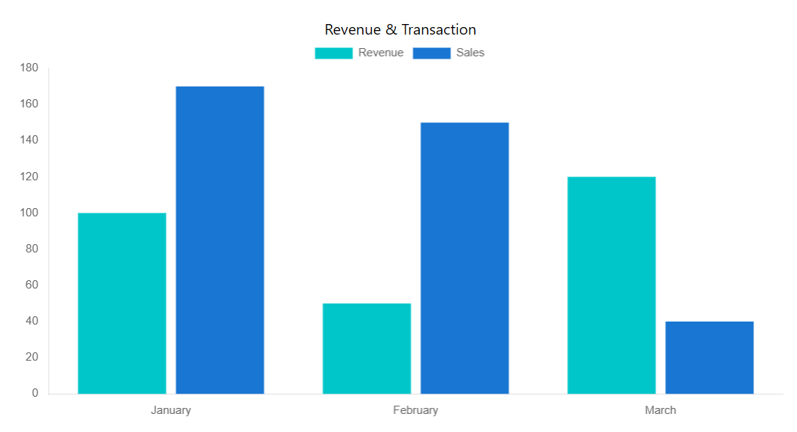

# Web Developemnt Notes: React

## Table of Contents

- [useEffect](#useeffect)
- [useContext](#usecontext)
- [useReducer](#usereducer)
- [useRef](#useref)
- [useMemo](#usememo)
- [useCallback](#usecallback)
- [Pure Component](#pure-component)
- [Routing](#routing)
- [Redux](#redux)
- [Middleware](#middleware)
- [Handling API calls](#handling-api-calls)
- [Higher order component](#higher-order-component)
- [Charts](#charts)
- [Tables](#tables)
- [Keywords](#keywords)

## useEffect

Used to synchronize components with some external systems (server, network, widget outside react)

### Execution order

- Component added to DOM for first time
  - __setup__ executed
- Dependency changed
  - component rerenders
  - __cleanup__ executed with old values
  - __setup__ executed with new values

```jsx
useEffect(()=>{
    ...setup function
    return ()=>{
        ...cleanup function
    }
},[dependencies]);
```

__Dependency__ props, state, variables and functions  
__No Dependency array__ run setup after every rerender  
__Empty Dependency array__ run on initial render but not on rerender

### Notes

1. In strict mode useEffect will run twice at first
2. It is hook so must be call at top most level. Not in loop or conditions.

## useContext

Creates a context data which can be accessed in any component without prop drilling.

### simple way of using context api

__Walkthrough__:

1. Create context using ```createContext``` which takes default value.
2. Wrap application with context provider using ```myContext.Provider```.
3. To access context anywhere use ```useContext``` with your context name.

__Create context object__

 ```
//Context.jsx
import React, { createContext } from "react";

export const MyContext = createContext(defaultValue);
 ```

- here we can't use `useState` because hooks can be used only in react component or in custom hook
- Also default value is not required becasue while wrapping application with provider it is mandatory to give value prop.

__Provide context to application__

```
//Index.jsx
import {MyContext} from './Context.jsx'

root.render(
    <MyContext.Provider value={"light"}>
        <App />
    </MyContext.Provider>
)
```

- Now here we can provide state and setState as value.

__Access context in component__

```jsx
//Page.jsx
import {useContext} from 'react';

export default Page = () =>{
    const myContext = useContext(MyContext)
}
```

### Better way to use context API

__Walkthrough__:

1. while creating context, create a react component as `ThemeProvider`
2. Now wrap app with `ThemeProvider` component.
3. All the wrapped app will be passed as children prop to `ThemeProvider`.
4. Render children prop in `ThemeProvider` component by wrapping it with context provider.
5. New flow of application will be  
    Main -> App -> ThemeProvider -> Other components

```
//contexts.js
import {createContext, useState} from 'react'

const ThemeContext = createContext();

export const ThemeProvider = ({children}) =>{
    const [theme, setTheme] = useState('dark');
    return(
        <ThemeContext.Provider value={[theme,setTheme]}>
            {children}
        <ThemeContext>
    )}


//App.js

return(
    <ThemeProvider>
        <Header>
        <Body>
    <ThemeProvider>
)
```

## useReducer

Used to manage complex states with custom actions.  
Walkthrough:

1. Create a state using ```useReducer``` with reducer function and initial value.
2. Create a reducer function which takes current state and action and changes state according to given actions.
3. call ```dispatch()``` with actions object to trigger reducer which will change state.
4. actions object will contain type and payload data.
5. for safety purpose create a ACTIONS constant and use that everywhere.

### create state with useReducer

```jsx
//App.jsx
import { useReducer } from 'react'

function App() {
    const [state, dispatch] = useReducer(reducer, InitialState)

    return ()
}
```

- Parameter
  - __reducer__ a function which changes state
  - __InitialState__ a object containing initial state
- Returns
  - An array containing
    - __state__ current value of state
    - __dispatch__ function to call actions

### reducer function

```
function reducer(state, action){
    switch(action.type){
        case 'action1':
            ...operation
            return modifiedState
        case 'action2':
            ...operation
            return modifiedState
        default:
            return state
    }
}
```

- Parameter
  - __state__ current state
  - __actions__ object containing type and payload
- Returns
  - new modified state

### dispatch function

calls reducer function by passing actions as parameter

```jsx
dispatch({type:'action1'})
```

### actions

Constant object to define action name. It used to prevent error in dispatch and reducer function.

```jsx
const ACTIONS = {
    INCREMENT : 'increment',
    DECREMENT : 'decrement'
}
```

### Note

1. Always make constant or variable of string if  it used multiple places
2. Do not modify state in reducer function since it is read only instead reutrn new state.
3. We can pass *initializer function* as 3rd argument in useReducer.
4. __initializer function__ return value of this function will be set as state. Only called at first render.

## useRef

### Overview

- `useRef()` returns a object `{current: value}` which value persists over re-render.

    ```jsx
    import {useRef} from react;

    const App = () => {
        const myRef = useRef(0);

        return (
            <h1>{myref.current}</h1>
        )
    }

    //output
    const myRef = { current:0 }
    ```

- To change value

    ```jsx
    myRef.current = myRef.current+1;
    ```

- This works just like normal variable expect it persist over re-renders (uses closure brhind the scene).
- unlike `useState` it does not re-render componet when value is changed

### using with dom node

- `useRef` is mostly used to refer dom nodes

    ```jsx
    const App = () => {
        const btnRef = useRef(null);

        return (
            <>
                <button ref={btnRef}> Click me </button>
            </>
        )
    }
    ```

- When dom is loaded then `btnRef.current` will be set to `button` elements
- Using this ref we can change element from react

    ```jsx
        useEffect(()=>{
            btnRef.current.style.backgroundColor: "red";
        },[]);
    ```

- `useEffect` is used so that style is changed after dom is loaded and ref is set to button else it will result in `null`.

## useMemo

> prevent expensive calculations during re-renders

### walkthrough

- `useMemo(function,dependency)`
- function returns value that is cached and during re-renders that value is used without calling function again until dependecy is changed.

```jsx
//App.jsx

function App = () => {
    const value = useMemo(()=>{
        ...calculation
        return modifiedNumber;
    },[number])
}
```

### Referential comparison

- when we need to track if object value is changed

```jsx
funnction App = () => {
    const [dark, setdark] = useState(true);
    const themeStyle = { color: dark ? 'black' : 'white'}

    useEffect(()=>{
        console.log('Theme is changed')
    },[themeStyle]);
}
```

- here useEffect is tracking change in themeStyle
- Whenever component is re-rendered due to any state themeStyle will create different object with same value but different reference.
- this different object will trigger useEffect
- Even though dark state is not changed and themeStyle is same still useEffect will log
- to prevent this we can use `useMemo` to memoize themestyle and change only when dark is changed

```jsx
const themeStyle = useMemo(()=>{
    return { color: dark ? 'black' : 'white'}
},[dark]);
```

### React.Memo

- React.Memo is HOC provided by react to pevent re-renders
- By default child is also rendered when parent is re-rendered.
- React.Memo prevent redenring by allowing render only when props is changed.

```jsx
const Child = React.Memo((props)=>{
    ...component
});

export default Child;
```

or

``` jsx
const Child = ( props ) => {
    ...logic
}

export default React.Memo(Child);
```

- Now child only renders when props is changed
- If props contain object then we can use `useMemo` to compare them.

## useCallback


## Pure component

- Render same output for same props and state
- Re-render only when props or state changes

### Features

- Compares props and state using shallow comparison (check reference)
- Was used in class based component. `React.Memo` is used for functional based component.

### Example

```jsx
import {PureComponent} from 'react';

class Counter extends PureComponent{
    render(){
        <h1>This is pure component</h1>
    }
}
```

## Routing

Used to navigate in application through URL path.  
Library -  `react-router-dom`  

### Walkthrough

1. Install `react-router-dom` library.
2. Wrap application with `<BrowserRouter>`
3. Create `Routes` and `Route` defining path and component relation.
4. Use `Link` to create navigation button or link.
5. Use `<Outlet />` to create placeholder for nested route in parent route.

### Router

wrap application with ```BrowserRouter```

```jsx
//index.jsx
import {BrowserRouter} from 'react-router-dom';
...
root.render(
     <BrowserRouter>
        <App />
     </BrowserRouter>
 );
```

### Routes

define ```Route``` inside ```Routes```

```jsx
//App.jsx
import {Routes, Route} from 'react-router-dom'

function App = () = {
    return (
       <Routes>
        <Route path='/' element={<Home/>} />
        <Route path='/about' element={<About/>} />
        <Route path='/contact' element={<Contact/>} />
        <Route path='*' element={<ErrorPage/>} />
       <Routes/>
    )
}
```

### Links

Wrap button with ```Link``` to enable routing.

```jsx
//Nav.jsx
import {Link} from 'react-router-dom'

....
<li><Link to='/about'>About</Link></li>
```

### Absolute v/s Relative path

| absolute | relative (recommended) |
|----------|----------|
| specify URL structure from root | specify URL structure from current route  |
| starts with ```'/'``` |  starts without ```'/'``` |
| clear & simple to understand | require time to understand very nested routes |
| complex for nested routes | more maintainable for nested routes |
| need to change all absolute path if subdirectory of app changes | no changes neede if app deployed to different directory |  

__absolute path__  

```
<Route path='/about' element={<About />} />
```

__relative path__  

 ```
 <Route path='courses' element={<Courses />}>
    <Route path='detail/:courseId' element={<CourseDetail />} />
 </Route>
 ```

### Nested Routing

Used when we need to render both parent component as well as child component.  
define ```Route``` inside ```Route```

```
function App = () = {
    return (
       <Routes>
        <Route path='/' element={<Home/>} />
        <Route path='/course' element={<Course/>} >
            <Route path='search element={<CourseSearch />} />
        </Route>
        <Route path='/contact' element={<Contact/>} />
       <Routes/>
    )
}
```

```<Outlet />```

- It is a placeholder component in parent component.
- It decides where child compoent will render in parent component.
- Used in parent component as a placeholder for nested route.
- It creates a socket where child routes can be plugged to render their content.
- In above example course will contain ```<Outlet />```

### Protected Routing

- to restrict route or component rendering based on certain conditions

    ```jsx
    const ProtectedRoute = ({isAuthenticated}) => {
        return (
            isAuthenticated ? <Outlet /> : <Navigate to='/login' />
        )
    }

    const App = () => {
        return (
            <Routes>
                <Route path='/login' element={<Login />} />
                <Route element={<ProtectedRoute  isAuthenticated={isAuthenticated}/>}>
                    <Route path='/home' element={<Home />} />
                </Route>

            </Routes>
        )
    }

    ```

### Redirect (Navigate)

- Redirect from one page to another page can achieved in two way.  
- Prev page -> Next Page
- __Optional property:__ `{replace: true | falsee}` is used to replace history of prev page with next page in browser.

#### `Navigate` component wrapper

- Declarative way to redirect to another page
- It is replaced from `Redirect` component in previous version

```jsx
import {Navigate} from 'react-router-dom';

return(
    <Navigate to='/admin/home' replace='false' />
)
// Also used on routing
<Route path='/admin' element=<Navigate to='/admin/home' replace /> />
```

#### `useNavigate` hooks

- Programitical way to redirect to another page
- Used to redirect on any event like button click or programitically
- `navigate(-1)` to go back as per browser history.

```jsx
import {useNavigate} from 'react-router-dom'

const navigate = useNavigate()

function handleClick(){
    navigate('/admin/home',{replace: true});
}
```

### useLocation

- `useLocation` hook is used to get current url
- `useLocation` return a location object

    ```jsx
    import {useLocation} from 'react-router-dom;

    const App = () => {
        const location = useLocation()
        console.log(location)

        location = {
            hash: "",
            key: "hl22e0if",
            pathname: "/product",
            search: "",
            state: null
        }
    }
    ```

### Notes

1. Use ```<Outlet />``` in navigation if there is nested routing.
2. ```'/path'``` gives absolute path whereas ```'path'``` gives relative path.
3. Types of other routers
    1. __BrowserRouter__
        - Have access to browser's history
        - Mostly used in web apps
    2. __HashRouter__
        - updates only # part of url
        - since part of url is updated so does not log in browser's history
        - url looks like `https://myapp.com/#/home`
        - Not SEO friendly
    3. __MemoryRouter__
        - ideal of server side routing
        - does not rely on browser's history

## Redux

It provides a centralized store for your application's state, along with mechanisms for updating that state in a controlled and testable manner.  

### walkthrough

- __Creating redux__ *(uses `@reduxjs/toolkit` library)*
    1. `createSlice` create a slice for each state which will return name, action generator functions and reducer for the application.
    2. `configureStore` create a store for application in which contains all your reducers.
- __Implementing redux__ *(uses `react-redux` library)*
    1. `Provider` wrap application making state available to entire application.
    2. `useSelector` to retrieve state in any component.
    3. `useDispatch` to change state use to send actions.

### createSlice

__Slice:__ provides tools to organize and manage a specific feature of app.  

__createSlice:__ Utility function to simplify and automate process of creating slice.

__arguments:__ an object including:

1. `name` used as prefix of action type to make it unique.
2. `initialState` initial value of state.
3. `reducers` object containing functions to update state.

__returns:__ an object including:

1. `name` Slice Name
2. `actions` action generators function
3. `reducer` a function combining all reducers and implement switch case based on action types

__Implementation:__

```
import { createSlice } from '@reduxjs/toolkit';

const counterSlice = createSlice({
    name: 'counter',
    initialState: {count: 0},
    reducers: {
        increment(state){state.count++},
        decrement: (state, action){state.count}
    }
});

export const {increment, decrement} = counterSlice.actions;
export default counterSlice.reducer; 
```

__reducers:__

- It is an object with key-value pair where
  - key: used as suffix of action type name
  - value: a reducer function mapped to that action type.
- reducers are pure function.
- reducer function accepts `state` and `<action>` as argument.
- state are immutable but due to `immer` integration it can be directly mutated.

__action generators:__  

1. action creators are functions that returns action object with type and payload.
2. `createSlice` creates action creator functions with same name as reducers key.
3. If we execute action creators it gives object contaning
    - __type__ <name/actionName>
     *counter/increment* or *counter/decrement*
    - __payload__ parameter passed while executing aciton creators

### configureStore

__Store:__ create common space for all states.  
__arguments:__ an object including:

1. `reducer` *(required)* reducers for all state and combine into one
2. `middleware` *(optional)* by default thunk is added.

```
import { configureStore } from '@reduxjs/toolkit';
import {counterReducer} from './counterSlice';
import {todoReducer} from './todoSlice';

const store = configureStore({
    reducer: {
        counter: counterReducer,
        todo: todoReducer
    }
});

export deafult store;
```

>Name provided to reducers will be used as state name. eg state.counter, state.todo

### Provider

To make store accessible to app.

 ```
 import ReactDOM from 'react-dom/client';
 import store from './store';
 import {Provider} from 'react-redux';

 const root = ReactDOM.createRoot(document.getElementById('root'));

 root.render(
    <Provider store={store}>
        <App />
    </Provider>
 )
 ```

### useSelector

`useSelector`

- is used to fetch state from store.
- takes a function which takes whole state and return required slice of state.

```
import {useSelector} from 'react-redux';

const app(){
    const count = useSelector((state)=>state.counter.count);

    return (

    )
}
```

### useDispatch

```useDispatch```  

- messenger between app and store.
- dispatch function send action object to store.
- action creator function is executed in dispatch function so that returned action object can be passed in dispatch funtion.

```
import {useDispatch} from 'react-redux';
import {increment, decrement} from './counterSlice';

const App(){
    const dispatch = Dispatch()
    dispatch(increment());

    return(
    )
}
```

__action object__  

- It contains two things
    1. __type__ *required* String
    2. __payload__ *optional* additional data

## Middleware

- __Problem:__ Reducer cannot handle api calls
  - Reducer are pure function. Same output for same input
  - Reducer should be predictable but api calls are not.
- __Solution:__ before calling reducer call  middleware to handle asynchronous tasks.
  - Dispatch → Middleware → Reducer
- Middleware can stop disptach or allow to reducer

### setup

1. Create middleware: middleware is curried function

    ```
    function logged(store){
        return function (next){
            return function (action){
                console.log(store, next, action);
                next(action);
            }
        }
    }
    ```

    - This can be also created by arrow function

        ```
        const logger = (store) => (next) => (action) => {
            console.log(store, next, action);
            next(action);
        }
        ```

    - `next(action)` should be called to run reducer

2. Add middleware in store
    - There are some default middlewares in store.
    - middleware must be callback which should return an array with all middlewares
    - To include default middlewares use `(defaultMiddleware)=>defaultMiddleware.concat(logger)`

    ```
    const store = configureStore({
        reducer: {
            products: productSlice,
            cart: cartSlice,
            wishlist: wishlistSlice
        },
        middleware: ()=>[logger]
    })
    ```

## Handling API calls

### using useffect hook

App.js

```

const App = () => {
    
    useEffect(()=>{
        fetch('API').then(res=>res.json()).then(data=>(
            dispatch(getData(data));
        ))
    })
}
```

Slice.js

```
const Slice = createSlice({
    name: 'data'
    initialState = []
    reducer: {
        getData: (state, payload)=>{
            return payload;
        }
    }
});

export const {getData} = Slice.actions;
export default Slice.reducer
```

- To handle loading and error state
App.js

```
useEffect(()=>{
    disptach(loadingData());
    fetch('API').then(res=>res.json()).then(data=>(
            dispatch(getData(data));
    ))
    .catch((err)=>{
        dispatch(loadingError(err));
    })
})
```

Slice.js

```
const Slice = createSlice({
    name: 'data'
    initialState = {
        loading: false,
        data: [],
        error: false;
    }
    reducer: {
        loadingData: ()=>{
            state.loading = true
        },
        getData: (state, payload)=>{
            state.loading = false;
            state.data = payload
        },
        loadingError: (state, payload)=>{
            state.loading = false;
            state.error = true
        }
    }
});

export const {getData, loadingData, loadingError} = Slice.actions;
export default Slice.reducer
```

### handling API from middleware

#### Walkthrough

- A special action is dispatched from application which is not available in redux.
- Custom middleware is created which will check for that special action else pass it
- Fetching from api is implemented in custom middleware and based on success or failure actions are dispatched.
App.js

```
useEffect(()=>{
    dispatch({
        type: 'makeAPICall',
        url: 'products'
    })
},[])
```

APIMiddleware.js

```
const BASE_URL = 'https://api.com'
const APIMiddleware = ({dispatch}) => (next) => (action) => {
    if(action.type==='makeAPICall'){      //insure middleware run for only api calls not for every dispatch
        dispatch(loadingData());
        fetch(`${BASE_URL}/${action.url}`).then(res=>res.json())
        .then(data=>next(getData(data)))
        .catch(e=>next(loadingError()))
    }
    else{
        next(action)
    }
}
```

#### Important notes

- If we want to use middleware for multiple API calls then loading, error and getData can be passed along with action instead of hardcoding in middleware.

```
useEffect(()=>{
    dispatch({
        type: 'makeAPICall',
        url: 'products',
        success: getData,
        error: loadingError,
        loading: loadingData
    })
})
```

- In middleware dispatch and next both are used to send action to reducer.
  - When dispatch is used it restart whole redux middleware chain. used to handle any sideeffect
  - When next is used it send action to next middleware or reducer indicating it has been processed by previous middlewares
- Order of middleware execution depends in array in store. First in array will be used first.

### handling API from redux-thunk

#### walkthrough

- Thunk is basically a middleware which check if action is function then it execute the function.
- `dispatch` can only dispatch simple object with type and payload to reducers. but with middleware we can handle functions.
- Inside the function fetching from api is implemented and based on success or failure action is dispatched.
- Action function will take dispatch so that function can dispatch actions.
- Function implementation is stored in slice file.
- Since By convention function is called in dispatch so we create a callback which will return a function. and we call callback function in dispatch.

```
// thunk Implementation
const customThunk = ({dispatch}) => (next) => (action) =>{
    if(typeof action=== 'function'){
        return action(dispatch)
    }
    else{
        next(action)
    }
}
```

- This function is generally exist in redux by default so we don't need to write middleware.

```
// app.js
import {getProductData} from './productSlice.js'
useEffect(()=>{
    dispatch(getProductData())
},[])
```

```
// productSlice.js

export const getProductData = () => (dispatch) => {
    dispatch(loadingData());
    fetch(api).then(res=>res.json())
    .then(data=>dispatch(getData(data)))
    .catch((e)=>dispatch(loadingError()))
}
```

### createAsyncThunk

#### walkthrough

- use `createAsyncThunk` to create action with type and function which will return payload of action.
- Add `extraReducer` in `createSlice` to handle three stages - pending, fulfilled, reject
- export `slice.actions`

#### createAsyncThunk

- Instead of creating a function and manually dispatching actions based on api result we can use `createAsyncThunk` function to create a action
- It is a action creator which take two parameters
  - __action type prefix:__ a string which will be action type to uniquely identify in reducer. prefix means later fulfilled, pending or rejected is added in action type based on api result
  - __function:__ a function which will return payload of action. also known as payload creator.

#### payload creator

- State of thunk depends on payload creator function
    1. `pending` after dispatch and before calling payload creator
    2. `fulfilled` if payload creator function returns data successfully
    3. `rejected` if payload creator function throws error.
- parameters
    1. `arg` data that is passed with dispatch
    2. `thunkAPi` an object which provide useful methods and properties.
    {
        dispatch: to dispatch any action,
        getState: access current state value,
        extra: any extra argument to configure `createAsyncthunk`,
        requestID,
        signal,
        rejectWithValue: to reject thunk with custom error payload. Should be returned
    }

```
\\ createAsyncThunk
export const fetchData = createAsyncThunk(
    'products/fetchData',
    async (arg, {rejectWithValue})=>{
        try{
            const res = await fetch('api')
            return res.json()
        }
        catch(e){
            return rejectWithValue("Api fetching failed")
        }
    }
)
```

#### extra reducers

- it contains a function which have reducers for three cases

```
extrareducers: (builder)=>{
    builder.addCase(fetchData.pending,(state)=>{
        state.loading = true
    })
    builder.addCase(fetchData.fulfilled,(state,action)=>{
        state.loading = false
        state.data = action.payload
    })
    builder.addCase(fetchData.rejected,(state,action)=>{
        state.loading = false
        state.error = action.payload
    })
}
```

#### dispatch and use

- to use thunk actions need to export thunk function instead of slice action generator.

```
dispatch(fetchData(userID))
```

### RTK Query

- RTK query help to query and mutate api data without creating thunk, slice, loading and error handler.
- RTK is part of @reduxjs/toolkit library.

#### walkthrough

- use `createAPI` from RTK to define reducer path, baseurl, endpoints and API calls
- add api reducer in store
- use query hooks in component to get data, isError, isLoading, error
- Use query and mutation to fetch and mutate data
- use query invalidation to refresh data when specific actions occur

### createAPI

## Higher order component

- HOC are just a function which takes a component and return component.
- HOC contains common functionality that is to be used by multiple components.
- Conventions
  - name starts with `With` like `WithLogging`
  - argument is called `WrappedComponent`

    ```jsx
    const WithLogging = (WrappedComponent) => {
        return (prop) => {
            console.log(props);
            return <WrappedComponent {...props} />
        }
    }

    export default Withlogging;
    ```

### Implementation

- This HOC will return new component which contain counter functionality.
- Props passed to this new component will be passed to WrappedComponent.

```jsx
//WithCounter.jsx

    const WithCounter = (WrappedComponent) => {
        return (props) => {
            const [count, setCount] = useState(0);
            function handleIncrease(){
                setCount(count+1)
            }
            function handledecrease(){
                setCount(count-1)
            }
            return <WrappedComponent {...props} />
        }
    }

    export default WithCounter;
```

- This component will create UI which uses counter functionality. But instead of writing functionality here we will pass this component to HOC to get new component with added functionality

```jsx
//BookCounter.jsx

    const BookCounter = (props) => {
        return (
            <>
                <h1>{props.Name}</h1>
                <button>decrease</button>
                <h2>{count}</h2>
                <button>increase</button>
            <>
        )
    }

    export default Withlogging(BookCounter);
```

- Here BookCounter refer to new component that is returned from HOC and then exported from BookCounter component.

```jsx
//App.jsx
    const App = () => {
        return(
            <BookCounter name={'BookCounter'}>
        )
    }
```

## Charts

Library used

1. `chart.js` raw javascript library providing customization options to charts that can be used with any framework.
2. `react-chartjs-2` build for react to provide chart components.

### setup

Importing libraries

```
import {Bar, Pie, Doughnut} from 'react-chartjs-2';
import {Chart as ChartJS} from 'chart.js';
```

Every options from chart.js needs to be register before using

``` diff
- import {Chart as ChartJS} from 'chart.js';
+ import { Chart as ChartJS, CategoryScale, LinearScale, BarElement Title, Tooltip, Legend, ArcElement, PointElement, LineElement, Filler, scales } from 'chart.js'

+ ChartJS.register( LinearScale, BarElement Title, Tooltip, Legend, ArcElement, PointElement, LineElement, Filler, scales )
```

Every chart component from react-chartjs-2 take two props

1. data: specific format of data
2. options: options to customize chart *(optional)*

```
<Bar data={data] options={options}/>
```

### Bar chart

#### data format

Data object takes values

1. __labels:__ array with x-axis values
2. __datasets:__ array of objects depending on number of bar chart to be shown in a chart. Each object contains two value.
    1. __label:__ name of values to be shown (Revenu, sales etc)
    2. __data:__ array of values corresponding to labels.

```
const data = {
    labels: ['January', 'February', 'March'],
    datasets: [
        {
            label: 'Revenue',
            data: [100,50,120],
            backgroundColor: '#00C6CA',
        },
        {
            label: 'Sales',
            data: [10000,150000, 4000],
            backgroundColor: '#1976d2',
        }
    ]
}
```



- To remove gap between bars

``` diff
{
    label: 'Revenue',
    data: [100,50,120],
    backgroundColor: '#00C6CA',
+   barPercentage: 1,
+   categoryPercentage: 0.4,
}
```

#### options

- Used to customize chart
- to remove grid lines

```
const options = {
    scales: {
      x: {
        grid: {
          display: false
        }
      },
      y: {
        grid: {
          display: false
        }
      }
    }
  }
```

## Tables

Library used `react-table`

- It is headless library which provides state, utilities and event listeners that can be added to own table.
- We have full control over markup and styling

### setup

- Install library  

    ```
    npm i react-table
    ```

- `useTable` is a hook which provides all functionality of table

    ```
    import {useTable} from 'react-table'
    ```

- __Data formatting:__ `useTable` takes data in two parts
    1. __columns:__ array of object with two value
        1. __Header:__ heading to be appear in table
        2. __accessor:__ respective key in json data

    ```
    columns = [
        {
            Header: "User",
            accessor: "user"
        },
        {
            Header: "Amount",
            accessor: "amount"
        },
        {
            Header: "Discount",
            accessor: "discount"
        },
        {
            Header: "Quantity",
            accessor: "quantity"
        },
    ]
    ```

    2. __data:__ actual json data

    ```
    [
        {
            "user": "John",
            "amount": 2000,
            "discount": 50,
            "quantity":70
        },
        {
            "user": "Mark",
            "amount": 1599,
            "discount": 23,
            "quantity":57
        }
    ]
    ```

- Create table

    ```
    const TableApp = () => {
        return (
            <table>
        <thead>
            <tr>
                <th>User</th>
                <th>Amount</th>
                <th>Discount</th>
                <th>Quantity</th>
            </tr>
        </thead>
        <tbody>
            <tr>
                <td></td>
                <td></td>
                <td></td>
                <td></td>
            </tr>
            <tr>
                <td></td>
                <td></td>
                <td></td>
                <td></td>
            </tr>
        </tbody>
    </table>
        )
    }
    ```

- Implement `react-table` features

    ```diff
    + import {useTable} from 'react-table';

    const TableApp = () => {
    +     const {
    +         getTableProps,
    +         getTableBodyProps,
    +         headerGroups,
    +         prepareRow,
    +         rows
    +     }  = useTable({columns, data});

        return (
    -        <table>
    +        <table {...getTableProps}>
                <thead>
    -                <tr>
    -                    <th>User</th>
    -                    <th>Amount</th>
    -                    <th>Discount</th>
    -                    <th>Quantity</th>
    -                </tr>
    +                {headerGroups.map(headerGroup)=>(
    +                    <tr {...headerGroup.getHeaderGroupProps()}>
    +                       {headerGroup.headers.map(column=>(
    +                            <th ...column.getHeaderProps()>
    +                                {column.render("Header")}
    +                            </th>
    +                        ))}
    +                    </tr>
    +                )}
                </thead>
    -            <tbody>
    -                <tr>
    -                    <td></td>
    -                    <td></td>
    -                    <td></td>
    -                    <td></td>
    -                </tr>
    -                <tr>
    -                    <td></td>
    -                    <td></td>
    -                    <td></td>
    -                    <td></td>
    -                </tr>
    +            <tbody ...{getTableBodyProps()}>
    +                {rows.map(row=>{
    +                    prepareRow();
    +                    return (
    +                        <tr {...row.getRowProps()}>
    +                            {row.cells.map(cell=>(
    +                                <td {cell.getCellProps()}>{cell.render+("Cell")}</td>
    +                            ))}
    +                        </tr>
    +                    )
    +                })}
                </tbody>
            </table>
        )
    } 
    ```

### table sorting

- `useSortBy` hook is used to implement sorting.

    ```diff
    - import {useTable} from 'react-table';
    + import {useTable, useSortBy} from 'react-table';

    ...

    const {
              getTableProps,
              getTableBodyProps,
              headerGroups,
              prepareRow,
              rows
    -     }  = useTable({columns, data});
    +     }  = useTable({columns, data}, useSortBy);

    ...

    <tr {...headerGroup.getHeaderGroupProps()}>
        {headerGroup.headers.map(column=>(
    -    <th ...column.getHeaderProps()>
    +    <th ...column.getHeaderProps(column.getSortByToggleProps())>
            {column.render("Header")}
    +        <span>
    +            {column.isSorted && (column.isSortedDesc "🔽"? "🔼")}
    +        </span>
        </th>
        ))}
    </tr>

    ```

### pagination

- `usePagination` is used to implement pagination in table

    ```diff
    - import {useTable} from 'react-table';
    + import {useTable, usePagination} from 'react-table';

    ...

    const {
              getTableProps,
              getTableBodyProps,
              headerGroups,
              prepareRow,
    -         rows
    +         page,
    +         state: {pageIndex},
    +         previousPage
    +         nextPage,
    +         canPreviousPage,
    +         canNextPage,
    +         pageCount
    -     }  = useTable({columns, data});
    +     }  = useTable({columns, data}, usePagination);

    ...
        <tbody {...getTableBodyProps()}> 
    -        {rows.map(row)=>{
    +        {page.map(row)=>{

    ...

        </table>
    +    {showPagination && (
    +        <div className="pagination">
    +        <button disabled={!canPreviousPage} onClick={previousPage}>Prev</button>
    +        <span>{pageIndex+1} of {pageCount}</span>
    +        <button disabled={!canNextPage} onClick={nextPage}>Next</button>
    +        </div>
    +    )}

    ```

## Keywords

1. conditional rendering
2. React Router - Router, Routes, Route, Link, Navigate, Location
3. Lifecycle - Initialization, Mounting, Updating, Unmounting
4. Hooks: how it works?
5. How state and prop affects render?
6. React fragments
7. CSS modules - locally scope css
8. Styled component
9. Prop drilling
10. Controlled and uncontrolled components
11. useref hook
12. Synthetic event
13. Events
