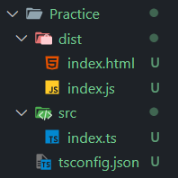
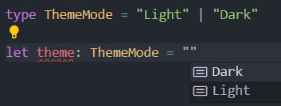

# Web developement Notes: typescript

## Table of Contents
- [Basics](#basics)
- [Datatypes](#datatypes)
- [Functions](#functions)
- [Classes](#classes)
- [Type assertion](#type-assertion)
- [Utility Classes](#utility-classes)
- [Generics](#generics)

## Basics
### typescript
* Strongly typed
* Supperset of javascript
* Object oreinted features
* Auto type inference

### installation
#### Library
Library used
```
npm i -g typescript
```
#### Compiler
* `tsc` is typescript compiler within `typescript library`.
* It converts `ts` file to `js` file
```
tsc index.ts
```

#### Watcher
* `-w` flag is used for continous compilation on any change
```
tsc index.ts -w
```
#### Compile & execute
* Library used `ts-node`
```
npm i ts-node
```
* It will compiler and execute js file in single command
```
ts-node index.ts
```

### folder structure
* __Problem:__ By default typescript compile in same folder which may cause scoping issue. For example, const variables after compilation will be decalartion in same scope causing error.
* __Solution:__ create two folder `src` _(for ts file)_ and `dest` or `build` _(for compiled js file)_

    

#### setup
1. Initialize typescript to get `tsconfig.json` to configure typescript.
```
tsc -init
```
2. Change two property in `tsconfig.json`
    1. `"srcDir":"./src"` path of source directory
    2. `"outDir":"./dist"` path of distribution directory


## Datatypesp
### implicit v/s explicit
* __Implicitly:__ typescript automatically decalre type of variable. `let a = "John"` here `a` will be assigned `string` datatype
* __Explicitly:__ defining type while decalaring variables or function. `let a: string = 'John`

### datatype declaration syntax
1. Explicit Type Annotation
    1. `let a: string = 'John'`
    2. `let a: number = 23`
    3. `let a: boolean = true`
    4. `let a: any = 'true'`
2. `let a = <string>'John'` Type Assertion (Casting)

### union types
`|` operator is used to declare multiple datatype to a variable
```
let a: string|number;
a = 'Hello'
a = 23
```

### function declaration
Define type of parameters and return value. If no return, type is `void`
```
const func = (n: number, m: number): string => {
    return string(n*m)
}
```

### type
* `type` is a way to create custom type by assigning datatypes to a variable.
* PascalCase naming convention is used for custom types
* For varibles
    ```
    type Username = string | number

    let name: Username;
    name = 23
    name = 'John'
    ```
* Functions
    ```
    type Func = (n: number, m:number) => string

    const func: Func = (n, m) => {
        return string(n*m)
    }
    ```
* Instead of datatypes we can assign values to datatypes
 

### array declaration
1. `let arr: string[] = ['Hello','World']`
2. `let arr: Array<string | number> = ['Hello',23]`

### object declaration
* Adding type while declaring variable
    ```
    let obj: {
        name: string,
        age: number
    } = {
        name: 'John',
        age: 26
    }
    ```
* Defining custom type
    ```
    type Obj = {
        name: string,
        age: number
    }

    let obj: Obj = {
        name: 'John',
        age: 26
    }
    ```
* Optional property
    ```
    type Obj = {
        name: string,
        age: number,
        dob?: string
    }
    ```
* Interface
    * Interface can be extended but type can't
    ```
    interface Obj {
        name: string,
        age: number
    }

    interface NewObj extends Obj {
        gender: boolean
    }

    let obj: NewObj = {
        name: 'John',
        age: 26,
        gender: false
    }
    ```
* readonly property
```
interface Product {
    readonly id: string,
    name: string,
    amount: number
}
```
readonly property can be used but can't be changed


## Functions
### optional parameter
```
type FuncType = (n: number, m: number, o?: number) => number;

const func: FuncType = (m,n,o) =>{
    if(o===undefined) return m*n
    return m*n*o
}

func(10,20) //200
```

### rest parameter
* Used to get multiple parameter as array
```
type FuncType = (...m: number) => number[]

const func: FuncType = (...m) => {
    return m;
}

func(10,20,30,40,50)
```

### custom type with function keyword
* defining type while decalaring function
```
function func(n: string, m: string): string {
    return n+m;
}
```
* function must be stored in variables to use custom types
```
type FuncType = (n: string, m: string) => string

const func: FuncType = function(n,m){
    return n+m;
}
```

### never type
* When a function throws error it means it never return anything, in that case return type of function will be `never`
```
const func = (): never =>{
    throw new Error();
}
```
* Instead of throw if it return error then return type will be `Error`
```
const func = (): Error =>{
    return new Error();
}
```

## Classes
* basic class with ts
```
class Player {
    height;
    width;
    constructor(height: number, width: number){
        this.height = height;
        this.width = width;
    }
}

const player1 = new Player(100,200);
console.log(player1.height)  //100
console.log(player1.w)  //200

```
* we can make property of class `readonly`
```
class Player {
    readonly id: string

    constructor(){
        this.id = String(Math.random()*100)
    }
}

const player1 = new Player();
player1.id = 23 // error
```
* ts provided ___access modifiers___ which is not available in js

### access modifier
1. __Public__ _default_ property of class are public which can be accessible outside and inside class
```
class Player {
    public height;
    width; 

    ...
}
```
2. __Private__ Properties to be used only within the class.
```
class Player {
    private height;
    width;
    constructor(height: number, width: number){
        this.height = height;
        this.width = width;
    }
}

const player1 = new Player(100,200);
console.log(player1.height)  //error
console.log(player1.width)  //200
```

3. __Protected__ properties can be used within class and inherited class but not with objects.
* If access modifier is used in constructor then no need declare it. 
```
class Player {
    constructor(private height: number, public width: number, protected age: number){
        this.height = height;
        this.width = width;
        this age = age
    }
}

class SubPlayer extends Player {
    constructor(height: number, width: number, age: number){
        super(height, width, age);
    }
    getAge = () => this.age; 
    getHeight = () => this.height; /error
    getWidth = () => this.width;
}

const player1 = new SubPlayer(100,200,26);
player1.getAge() //26
player1.getHeight() //error
player1.getWidth() //200
```

### setter & getter
* function used to set and get values of property without calling function
* getter & setter function can be used to get and set private and protected properties also.
* getter must have a return value and no parameter and setter have no return value and 1 parameter
```
class Player {
    height: number
    width: number

    constructor(height: number, width: number){
        this.height = height
        this.width = width
    }

    get getPlayerHeight(): number {
        return this.height
    }

    set setPlayerWidth(width: number): void {
        this.width = width
    }
}

const player = Player(100,200);
player.getPlayerHeight; //100
player.setPlayerWidth = 300;
```

### implements
* used to define structure of class by an interface
* When access modifiers are used in constructor then assigning variable using `this` is not required.
* Class must have all property from interface and can have additional property.
* A class can have multiple interface.
* properties from interface can't be private in class

```
interface ProductType {
    name: string,
    amount: number,
    stock: number,
    offer?:boolean
}

interface GiveId {
    getId: string
}

class Product implements ProductType, GiveId {
    private id = String(Math.random()*100)

    constructor(
        public name: string,
        public amount: number,
        public stock: number
    ){}

    get getId():string{
        return this.id
    }
}

const sample = new Product("Apple",20000, 500);
```

## Type assertion
>Type assertion in TypeScript is a way to explicitly tell the compiler the specific type of a value when TypeScript cannot infer it correctly.

* Type assertion is majorly used in 
    1. Dom manipulation
    2. Narrowing down union types
    3. JSON parsing
* Two types of assetion
    1. `const a = <string>'John'`
    2. `const a = 'John' as string`
### Dom manipulation
```
const btn = document.getElementById('btn');
```
* By default type of `btn` will be `HTMLElement | null` since typescript doesn't know if btn element exist or not.
* But we can tell typescript that is exist and not to keep null
    * Method 1
        ```
        const  btn = <HTMLElement> document.getElementById('btn')
        ```
    * Method 2
        ```
        const  btn = document.getElementById('btn') as HTMLElement
        ```
    * Method 3
        ```
        const  btn = document.getElementById('btn')!
        ```
* Some elements have sepecific property like src for that we have to tell typescript which element is being accessed.
    ```
    const img = <HTMLImageElement>document.getElementById('img')
    ```
* Or we can choose query selector. It can be null
    ```
    const img = document.querySelector('img')!
    ```

### keyof
* __Problem:__ Suppose we want to access object value from key
```
type Person = {
    name: string,
    age: number
}

const person: Person = {
    name: 'John',
    age: 26
}

let key: string = 'name'
person[key]   //error since value of key can change and can be anything

const key2: string  = 'name'
person[key2]   // it will work since key2 is constant
```
* __Solution:__ type assertion can be used to specifiy type of key
```
let key: string = 'name'
person[key as keyof Person]
```
* if we don't know type of person object then we can use `typeof` operator to get type of object
```
person[key as keyof typeof person]
```

* `keyof` can be used in function as well
```
type Person = {
    name: string,
    age: number
}

const person: Person = {
    name: 'John',
    age: 26
}

const getPersonVal = (key: keyof Person): string|boolean =>{
    return person[key]
}

getPersonVal('name')
```

## Utility classes
1. `Partial<Type>` to make property optional
    ```diff
    type Person = {
        name: string,
        age: number
    }
    - type NewPerson = {
    -    name?: string,
    -    age?: number
    - }
    + type NewPerson = Partials<Person>
    ```

2. `Required<Type>` make every optional property required. opposite of partials.
    ```diff
    type Person = {
        name?: string,
        age: number
    }
    - type NewPerson = {
    -    name: string,
    -    age: number
    - }
    + type NewPerson = Required<Person>
    ```

3. `Readonly<Type>` make every property readonly
    ```diff
    type Person = {
        name?: string,
        age: number
    }
    - type NewPerson = {
    -    readonly name?: string,
    -    readonly age: number
    - }
    + type NewPerson = Readonly<Person>
    ```

4. `Record<key, Type>` used to check keys
    ```
    interface UserInfo {
        age: number
    }

    type User = 'John'|'David'|'Peter'

    const user: Record<User, UserInfo> = {
        John: { age: 26 },
        David: { age: 29 },
        Peter: { age: 32 }
    }
    ```

## Generics 
Generics is a feature that allows a function to work with any datatype while keeping type safety.
* __Problem:__ A function that takes any datatype value and returns that datatype value. Here, type of `a` & `b` will be `any` which is not efficient. 

    ```
    const func = (n: any): any => {
        return n
    }
    var a = func("Hello")
    var b = func(20)
    ```
* __Solution:__ In generics, we declare a placeholder type which will take replaced by argument type. This placeholder is generally denoted by `T`. Here type of `a` will be `string` and type of `b` will be `number`
    ```
    const func = <T>(n: T): T => {
        return n
    }
    var a = func("Hello")
    var b = func(23)
    ```
* In above example typescript infer type of passed argument and put as T. We can manaually decalre type of passed argument as well
    ```
    var a = func<string>("Hello")
    ```

### extend in generics
* we can declare second placeholder type by extending first one. Below if first argument is number then second argument also have to be number.
    ```
    const func = <T, O extends T>(m: T, n: O): {m: T, n: O} => {
        return {m,n}
    }

    var a = func<number, number>(23,16)
    var a = func<string, string>(19,29.3)
    ``` 
* __extends with object:__ Here O must contain all type from T and may contain types.
    ```
    type Person = {
        name: string,
        age: number
    }

    const person = {
        name: 'John'
        age: 20
    }

    const func = <T, O extends T>(m: T, n:O): void =>{}
    var a = func<Person>(person,{name: 'Peter',age:32, address: 'London'})
    ```

### Complex Example
* A function which filter out user from users array based on key and value provided
    ```
    const Users = {
        name: string,
        age: number
    }

    const users: Array<Users> = [
        {
            name: 'John',
            age: 29
        }
        {
            name: 'Peter',
            age: 32
        }
        {
            name: 'Mark',
            age: 57
        }
        {
            name: 'Chris',
            age: 43
        }
    ]

    const filterUsers = <T, O extends keyof T>(users: T[], key:O, value: T[O]): T[] =>{
        return users.filter(user=>user[key]===value)
    }

    const filteredUsers = filterUsers(users,"name","mark")
    ```